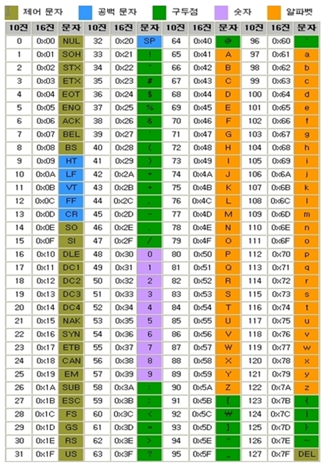

# 1 주차 혼공컴운 정리

# 1-2. 컴퓨터 구조의 큰그림

## 메모리

메모리는 현재 실행되는 프로그램의 명령어, 데이터를 저장하는 부품이다. 메모리는 저장된 데이터와 명령어에 효율적으로 접근하기 위해 주소(address)라는 개념을 사용한다.

## CPU

CPU는 메모리에 저장된 명령어를 읽고 실행하는 장치로 크게 아래와 같이 3가지 구성요소로 이루어진다

### 1.ALU(Arithmetic Logic Unit)

산술논리연산장치라고 불리는 ALU는 프로그램에서 수행되는 대부분의 계산을 맡아서 수행한다

### 2. 레지스터

CPU 내부의 존재하는 작은 임시 저장 장치이며, 프로그램을 실행하는 데 필요한 값들을 임시로 저장한다. 참고로 cpu내부에는 각기 다른 역할을 수행하는 여러 레지스터가 존재한다

### 3. 제어장치

제어 장치는 컴퓨터 부품을 관리 및 동작 시키기 위한 제어 신호를 보내고 명령어를 해석하는 장치이다. 

- 메모리 읽기 쓰기 예시
    - 메모리 읽기: 메모리에 저장된 값을 읽고 싶을때 메모리에 메모리읽기 라는 제어신호를 보냄
    - 메모리 쓰기: 메모리에 값을 저장하고 싶을때 메모리 쓰기라는 제어신호를 보냄
    
    ```
    1. 다음 명령어를 실행하기 위해 제어 장치는 메모리 읽기 제어신호를 제어 버스를 통해 보낸다.
    2. 이후 다음에 실행할 명령어가 존재하는 주소를 주소 버스를 통해 cpu에서 메모리에 전달
    3. 메모리는 해당 명령어가 존재하는 주소에 저장된 명령어를 데이터 버스를 통해 CPU의 명령어 레지스터에 저장
    4. 제어장치는 레지스터에 저장된 명령어를 해석한 뒤 명령어 실행
    5. 만약 산술적인 연산이 필요하면 ALU를 통해 연산을 수행한다 
    ```
    

# 02-1. 0과 1로 숫자를 표현하는 방법

## 2의 보수

2의 보수란 컴퓨터 시스템에서 음의 정수를 표현하기 위해 널리 사용 되는 방법이다. 해당 방식을 이용하면 덧샘 연산을 간단하게 수행할 수 있다.

- 2의 보수 계산법(8 비트에서 -5 표현)
    1. 양수를 2진수로 변환
        
         → 5의 2진수 0000 0101
        
    2. 비트 반전
        
        → 0000 0101 → 1111 1010
        
    3. 1 더하기
        
        → 1111 1010 + 1 → 1111  1011
        
    

## 16진법

컴퓨터 시스템에서는 2진법 이외에 16진법 도 자주 사용된다. 16진법이란 수가 15를 넘어가는 시점에 자리 올림을 하는 방식으로 아래와 같이 표기한다

| 10진수 | 0 | 1 | 2 | 3 | 4 | 5 | 6 | 7 | 8 | 9 | 10 | 11 | 12 | 13 | 14 | 15 | 16 | 17 |
| --- | --- | --- | --- | --- | --- | --- | --- | --- | --- | --- | --- | --- | --- | --- | --- | --- | --- | --- |
| 16진수 | 0 | 1 | 2 | 3 | 4 | 5 | 6 | 7 | 8 | 9 | A | B | C | D | E | F | 10(올림) | 11 |

## 16진수를 2진수로 변환

16진수 숫자하나를 2진수로 표현하기 위해서는 4개의 비트가 필요하다.  따라서 16진수를 2진수로 변환하기 위해서는 16진수의 각 숫자를 4개의 숫자로 구성된 2진수로 변환하고 그것을 이어 붙이는 방식으로 변환이 가능하다.

## 2진수를 16진수로 변환

반대로 2진수를 16진수로 변환하기 위해서는 2진수를 4 개씩 나누고, 각 숫자를 하나의 16진수로 변환한뒤 이어 붙이면 된다.

# 02-2. 0과 1로 문자를 표현하는 방법

## 문자 집합

컴퓨터가 표현할 수 있는 문자의 모음

## 문자 인코딩

문자를 컴퓨터가 이해할 수 있도록 하기 위해서는 문자를 0과 1로 변환하는 문자 인코딩이 필요하다.

## 문자 디코딩

반대로 0과 1로 표현된 문자를 사람이 이해할 수 있도록 문자로 변화하는 과정이 문자 디코딩이라고 한다

## 아스키 코드

아스키 코드는 문자 0부터 127까지 총 128가지의 숫자와 문자를 일대일로 대응하는 표이다. 아스키 코드를 이용해 문자를 인코딩, 디코딩할 수 있다.



```
아스키 코드는 매우 간단하게 인코딩 된다는 장점이 있지만 특수 문자나 한글을 표현할 수 없다.
```

## 한글 인코딩

한글을 초성 중성 종성의 조합으로 이루어진 한글을 인코딩하는 방법은 크게 완성형 인코딩 방식과, 조합형 인코딩 방식 두 가지로 구분 된다/


- 완성형 인코딩: 초성, 중성, 종성 조합으로 이루어진 하나의 글자에 고유한 코드를 부여하는 방식
- 조합형 인코딩: 초성 비트열, 중성 비트열, 종성 비트열을 각각 할당하고 비트열의 조합으로 하나의 글자를 완성하는 방식

## 유니코드 문자 집합과  UTF-8

### 유니코드

- 전세계의 모든 문자를 컴표터에서 일관 되게 인식하고 표현할 수 있도록 설계된 문자집합
- 아스키 코드와 같이 각 문자마다 아래처럼 고유한 값이 부여된다.


### UTF-8

- 유니코드의 부여된 값을 인코딩하는 방법 중 하나 (유니코드를 인코딩하는 방법은 UTF-8, UTF-16,32 등이 있다.)
- UTF-8의 인코딩 결과는 1 바이트 ~ 4바이트로 가변 길이 인코딩이다.
- “한글” UTF-8 인코딩 예시
    
    
    
    1. ‘한’에 부여된 유니코드 값은 D55C, ‘글’에 부여된 값은 AE00이다.
    2. 위 표를 보면 ‘한’과 ‘글’은 모두 0800~FFFF 범위에 속해 있으므로 모두 3바이트로 인코딩 된다.
    3. 이후 ‘한’과 ‘글’의 부여된 이진수 값을 3바이트의 인코딩 결과인 1110XXXX 10XXXXXX 10XXXXXXX에 이진수로 변환하여 붉은색 X 표시로 된 곳에 대입한다.
    

# 03-1 소스코드와 명령어

## 고급언어와 저급언어

개발자가 작성한 소스코드를 컴퓨터에서 실행하기 위해서는 고급언어로 작성된 소스코드를 저급언어로 변환한 뒤 실행해야한다.


- 고급언어: 개발자가 이해하기 쉽게 만든 언어(c++, python, java…)
- 저급언어: 컴퓨터가 이해하고 실행하는 언어 (명령어)

## 저급 언어

저급언어는 크게 0과 1로 표현된 기계어와 어셈블리어로 나뉜다 


- 어셈블리어: 0과 1로 이루어진 기계어를 읽기 편한 형태로 번역한 저급언어


### 고급언어

C++, python, java와 같이 소스코드를 작성할 때 사용하는 언어로 크게 컴파일 언어와 인터프리터 언어로 구분 된다


- **컴파일 언어**: 컴파일 언어는 고급언어로 작성된 소스코드를 컴파일러에 의해 저급언어인 목적코드로 변환된다.
    
    
    
- **인터프리트 언어:** 인터프리터에 의해 한줄 씩 실행 되는 언어, 따라서 컴파일언어와 같이 소스코드 전체가 목적코드로 변환되기 까지 기다릴 필요 없음

### 컴파일 언어와 인터프리트 언어 차이


컴파일 언어와 같은 경우 컴파일 중 오류가 존재하면 소스코드 실행 불가

인터프리트 언어는 오류 발생 직전까지 실행하다 오류가 발생하면 실행 중지

# 03-2 명령어의 구조

명령어는 크게 수행할 연산의 종류를 나타내는 연산 코드와 연산에 사용될 데이터 혹은 데이터가 저장된 위치를 나타내는 오퍼랜드로 이루어져있다.


- 명령어의 예시


## 오퍼랜드

연산에 사용될 데이터 혹은 연산에 사용될 데이터가 저장된 위치를 나타낸다. 흔히 오퍼랜드는 직접적인 데이터보다 데이터가 저장된 위치를 나타내는 경우가 많기 때문에 주소필드라고 부르기도한다


## 연산 코드

명령어가 수행할 연산을 나타내며 크게 아래와 같이 네가지가 있다.

- 데이터전송
    1. MOVE: 데이터 이동
    2. STORE: 메모리 저장
    3. LOAD: 메모리에서 CPU로 데이터 가져오기
    4. PUSH: 스택에 데이터를 저장
    5. POP: 스택 최상단에 데이터 가져오기
- 산술/논리 연산
    1. ADD/SUB/ MUL/DIV: 사칙연산
    2. INCREMENT / DECREMENT: 오퍼랜드에 1을 더하거나 빼기
    3. AND/ OR/ NOT: 논리 연산
    4. COMPARE: 두개의 숫자 혹은 TRUE/ FALSE 비교
    
- 제어 흐름 변경
    1. JUMP: 특정 주소로 실행 순서 변경
    2. CONDITIONAL JUMP: 조건에 부합할때 특정 주소로 실행순서 변경
    3. HALT: 프로그램의 실행을 멈춰라
    4. CALL: 되돌아올 주소를 저장한채 특정 주소로 실행 순서 옮겨라
    5. RETURN: CALL 을 호출할 때 저장했던 장소로 돌아가라
    
- 입출력 제어
    1. READ: 특정 입출력 장치로 부터 데이터 읽기
    2. WRITE: 특정 입출력 장치로 데이터 쓰기
    3. START TO: 입출력 장치 시작
    4. TEST IO: 입출력 장치 상태 확인

# 04-1 ALU와 제어장치

CPU를 구성하는 장치중 ALU와 제어장치에 대해서 알아보자

- ALU: 산술 연산을 담당하는 장치
- 제어장치: 제어신호를 발생시키고 명령어를 해석하는 장치

## ALU


### ALU가 받아 들이는 정보

ALU는 레지스터와 제어장치로 부터 받은 정보를 이용해 연산을 수행한다.

- 레지스터로 부터  연산에 필요한 피연산자
- 제어장치로 부터 제어 신호를 받아 들인다.

### ALU가 내보내는 정보

- 산술 연산의 결과값을 레지스터로 내보낸다.
- 부가 정보(양수, 음수, 오버플로우 등)를 플래그 레지스터로 내보낸다.
    
    
    
- 플래그의 종류
    
    
    

## 제어장치


### 제어장치가 받아들이는 정보

- 클럭: 컴퓨터의 모든 부품이 동작할 수 있도록 하는 시간 단위, 클럭 신호에 맞춰서 명령어들이 수행된다.
    
    
    
- 해석할 명령어: 명령어 레지스터에서 해석할 명령어의 정보를 받아들인다.
- 플래그: 명령어를 해석하기 위해 플래그 레지스터에서 플래그 정보를 확인한다.
- 제어신호: 입출력장치와 cpu등에서 제어신호를 받아들인다

### 제어장치가 내보내는 정보

제어장치는 기본적으로 제어신호를 내보내는데  크게 cpu 내부에 전달하는 제어신호와 cpu외부에 전달하는 제어신호로 구분된다.

- CPU 내부: 레지스터의 행동을 제어, ALU가 수행할 연산을 제어하는 신호를 내보냄
- CPU 외부: 메모리 읽고 쓰기, 입출력 장치 제어하는 신호를 보냄

# 04-2 레지스터

레지스터는 CPU를 구성하는 작은 임시 저장장치를 의미하며 명령어 혹은 데이터를 저장한다.

## 반드시 알아야할 레지스터

- **프로그램 카운터(PC)**: 메모리에서 가져올 명령어의 주소 ( 다음에 실행할 명령어가 저장된 주소)
- **명령어 레지스터(IR)**: 현재 실행중인 명령어 (방금 메모리에서 읽어 들인 명령어)
- **메모리 주소 레지스터:** 메모리의 주소 (CPU가 주소 버스로 제어신호를 보낼때 거치는 레지스터)
- **메모리 버퍼 레지스터:** 메모리와 주고 받을 값(데이터, 명령어)
- 예시
    
    실행할 프로그램이 사용하는 메모리가 1000번지부터 1500번지 까지 존재한다고 가정할때. 프로그램을 실행하기 위해서는 아래와 같은 단계를 거친다.
    
    
    
    1. 프로그램의 처음 명령어가 메모리의 1000번지에 존재하므로 PC 에 1000 번지 주소를 저장한다.
        
        
        
    2. PC에 저장된 1000번지의 명령어를 메모리로 부터 읽기 위해서는 주소버스를 통해 읽고자하는 메모리의 주소에 제어신호를 보내야하므로 PC에 저장된 값을 메모리 주소 레지스터에 복사한다.
        
        
        
    3. 주소버스를 통해 다음에 읽을 메모리의 주소값에 제어신호를 보내고 메모리에 메모리 읽기 제어신호를 전송한다.
        
        
        
    4. 이후 메모리에서 전달 받은 값을 메모리 버퍼 레지스터에 저장 한뒤 PC에 저장된 값을 1증가 시킨다.(1000번지의 명령어를 실행했기 때문에 다음에 실행할 명령어의 주소인 1001번지를 미리 저장)
    
    
    
    1. 해석할 명령어를 명령어 버퍼 레지스터에서 명령어 레지스터로 복사한뒤 명령어를 해석한다.

- **플래그 레지스터:** 연산 결과 또는 CPU 상태에 대한 부가적인 정보
- **범용 레지스터:** 일반적인 상황에서 자유롭게 사용
- **스택 포인터:** 스택의 최상단을 가리키는 레지스터(스택이 어디까지 차있는지 확인하기 위해 사용)
    
    
    
- **베이스 레지스터:** 변위 주소 지정방식(오퍼랜드의 값인 변위과 베이스 레지스터의 값을 더해서 주소를 지정하는 방식)에 사용하는 레지스터로 기준이 되는 주소를 저장한다.
    
    
    

# 04-3 명령어 사이클과 인터럽트


### 명령어 사이클과 인터럽트

- 명령어 사이클: CPU는 메모리에 저정된 명령어들을  일정한 주기를 반복하며 실행하는 데 이 주기를 명령어 사이클이라고 한다.
- 인터럽트: 명령어 사이클을 끊는 행위

## 명령어 사이클

명령어 사이클은 인출사이클과 실행 사이클을 반복하며 프로그램을 실행한다.

### 인출사이클

- 메모리에 저장된 값을 cpu로 가져오는 것을 인출 사이클이라한다


### 실행 사이클

- 갖고 온 명령어를 가져와서 실행하는 것을 실행 사이클이라 한다.
- 간접 사이클
    
    명령어를 바로 인출할 수 없거나 메모리에 반복해서 접근해야하는 경우 간접 사이클 발생
    
    
    

## 인터럽트

- 명령어 사이클이 실행 되다가 CPU가 급하게 처리해야할 다른 작업이 생겼을 때 발생
- 인터럽트의 종류는 크게 동기 인터럽트와 비동기 인터럽트로 나뉜다.
    
    
    

### 동기 인터럽트

- cpu가 예기치 못한 상황을 접했을 때 발생

### 비동기 인터럽트

- 입출력 장치에 의해 발생하는 인터럽트(키보드입력, 마우스 클릭 등)
- CPU 가 입출력 작업 도중에 효율적으로 명령어를 처리하기 위해 비동기 인터럽트 사용

```
cpu가 입출력 장치에 접근하는 시간은 메모리에 접근하는 시간에 비해 매우 느리다. 만약 비동기 인터럽트를 사용하지 않는 다면 
cpu는 입출력 장치가 작업을 완료하기전까지 기다려야하므로 매우 비효율적이다.
이때 비동이 인터럽트를 사용한다면 cpu는 입출력 장치의 작업이 완료 되는 동안 다른 명령어를 수행할 수 있다.
```

### 비동기(하드웨어) 인터럽트의 처리 순서

1. 입출력장치에서 cpu로 인터럽트 신호 전송
2. cpu를 실행 사이클이 끝나고 다음 명령어 메모리에서 인출하기 전 인터럽트 여부를 확인
3. cpu가 입출력 장치에서 보낸 인터럽트 요청을 확인한 뒤 인터럽트 플래그를 통해 현재 인터럽트를 받아들일 수 있는 지 확인
4. 만약 받아 들일 수 있다면 cpu는 지금 까지의 작업을 백업(레지스터 상태, 프로그램 카운터)
5. 이후 cpu는 인터럽트 벡터를 참조하여 인터럽트 서비스 루틴을 실행
6. 인터럽트 서비스 루틴의 실행이 끝나면 백업해둔 작업을 복구하여 실행을 재개

### 인터럽트 서비스루틴:


- 인터럽트가 발생했을 때 해당 인터럽트에 대한 처리 프로그램
- 인터럽트 서비스 루틴도 프로그램이기에 메모리에 저장되어 있다.

### 인터럽트 벡터

- cpu가 인터럽트 요청을 받았을 때 해당인터럽트를 처리할 인터럽트 서비스 루틴의 시작주소를 찾기 위한 데이터 구조
- 인터럽트 벡터

# 05-1 빠른 CPU를 위한 설계 기법

cpu를 빠르게 개선하기 위해 아래 세가지 측면에서 개선할 수 있다

## 클럭

- 클럭 속도 증가

## 코어 & 멀티 코어

코어란 cpu 내에서 명령어를 실행하는 부품이며, 코어를 여러개 갖는 cpu를 멀티코어라고 부른다.


- 코어 늘리기:

## 쓰레드 & 멀티 쓰레드

쓰레드란 실행흐름의 단위를 의미하며 하드웨어적 스레드와 소프트웨어적 스레드로 나뉜다.


### 하드웨어 쓰레드

하드웨어 스레드는 하나의 코어가 동시에 처리하는 명령어 단위이다. 

- 2개의 코어가 각각 2개의 명령어를 동시에 처리한다면 2코어 4스레드

### 소프트웨어 스레드

하나의 프로그램에서 독립적으로 실행되는 단위를 의미한다. 만약 프로그램이 하나의 흐름으로 실행 된다면 싱글 스레드 여러개의 흐름으로 실행 된다면 멀티 스레드라고 한다.


# 05-2 명령어 병렬 처리 기법

## 명령어 파이프라인

### 명령어 처리 단계


하나의 명령어가 처리 되는 과정을 나누면 아래와 같으며 현대의 cpu는 명령어 처리 단계과 겹치지 않는 다면 각 단계를 동시에 실행할 수 있다. 

1. 명령어 인출
2. 명령어 해석
3. 명령어 실행
4. 결과 저장

### 파이프라인 위험


다음과 같은 위험 때문에 명령어 파이프라인이 항상 작동하는 것은 아니다.

- **데이터 위험**: 명령어간 의존성에 의해 발생하는 위험(이전 명령어를 끝까지 실행해야만 다음 명령어를 실행 할 수 있는 경우)

```
명령어 1: R1 <- R2 + R3 // R2의 레지스터 값과 R3의 레지스터 값을 더한 값을 R1에 저장
명령어 2: R4 <- R1 + R5 // R1의 레지스터 값과 R5의 레지스터 값을 더한 값을 R4에 저장
```

- **제어 위험**: 프로그램 카운터의 갑작스러운 변화에 의해 발생, (조건문 ..)
    
    
    
- **구조 위험:** 서로 다른 명령어가 같은 CPU 부품 (레지스터, ALU) 를 쓰려고 할때 발생

# 05-3 명령어 집합 구조 CISC & RISC

## 명령어 집합

- CPU 가 이해할 수 있는 명령어들의 모음
- 인텔, ARM등 각 cpu가 이해할수 있는 명령어들이 다르기에 명령어집합이 다르다.
- 대표적인 현대의 명령어 집합으로는 CISC와 RISC가 있다

## CISC(complex instruction set computer)

- 복잡한 명령어 집합을 활용하는 cpu의 명령어 집합
- 명령어 형태와 크기가 다양한 가변 길이 명령어 활용
- 명령어 하나가 여러 기능을 제공하기 때문에 상대적으로 적은수의 명령어로 프로그램을 실행 가능하다
- 명령어 하나가 복잡한 기능을 제공하기에 명령어 파이프라인에 불리하다

## RISC(Reduced Instruction set computer)

- 명령어의 종류가 적고, 짧은 규격화(가급적 1클럭 이내)된 명령어를 사용
- 메모리 접근을 최소화하고, 레지스터를 더 활용하는 경향이 있기에 cpu의 레지스터 개수도 많다.
- CISC에 비해서 명령어파이프라인에 유리하다.

